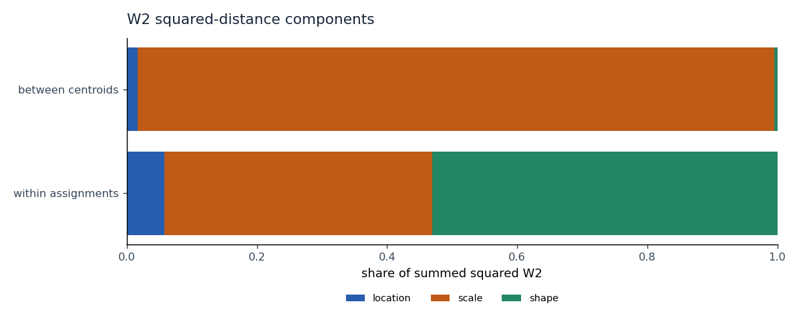

# Wasserstein Regimes

**Market-regime research using optimal transport on full empirical return distributions.**

Instead of representing each rolling market window with a few summary statistics, this project treats the entire empirical return distribution as the observation. Windows are compared with Wasserstein distance and clustered around distributional centroids.

**Question:** What market-state information is lost when a return window is compressed into volatility or a few moments?

**Measured result:** In the frozen SPY study, **97.87% of raw-W2 centroid separation is scale**. Strict holdout assignments agree closely with volatility-only clustering (**ARI 0.990**). Full distributions separate exact matched-four-moment synthetic laws, but this study does not establish added predictive value from shape.



Rolling returns → empirical distributions → Wasserstein geometry → distributional k-means → chronological regime assignments.

Exact one-dimensional W2 clustering of equal-size empirical distributions is Euclidean k-means over **all order statistics**, rather than selected moments. W2 uses mean quantile barycenters; W1 uses median barycenters. Sorting intentionally discards within-window temporal order.

## Why this is interesting

Moment-based representations can discard differences in skew, tails and multimodality. For equal-length sorted samples `x` and `y`:

```text
W1(x, y)   = mean(abs(x - y))
W2(x, y)^2 = mean((x - y)^2)
```

A discovered cluster describes observed return distributions. It does not automatically imply persistence, predict the next regime or define a trading strategy.

## Completed research release

- Frozen daily SPY snapshot, five development folds and a fixed 2024–August 2026 holdout.
- Raw W2, W1 and shape-only W2; volatility, mean/volatility, moments, rich features, GMM and causal HMM baselines.
- Exact location/scale/shape decomposition, seed/block/refit stability, overlap-null persistence, validation-calibrated novelty and evaluation-only future outcomes.
- Five synthetic controls, window-length power/delay studies, measured kernels, immutable artifacts and saved-artifact HTML reports.
- 142 tests, including independent numerical oracles and a full price-prefix leakage regression.

Read the [measured results](docs/research-results.md), [reproduction workflow](docs/research-workflow.md), [data sourcing](docs/data.md), [paper review](docs/paper-review.md), [design](docs/design.md) and [future implementation roadmap](docs/implementation-plan.md). Aggregate evidence is saved in [results](results/).

## Repository structure

```text
wasserstein-regimes/
├── src/wasserstein_regimes/  # transport, clustering, data, evaluation and reporting
├── tests/                   # numerical, temporal and artifact verification
├── configs/                 # frozen empirical specifications
├── results/                 # measured aggregate evidence
├── examples/                # offline mathematical smoke example
├── benchmarks/              # transport benchmark entry point
├── scripts/                 # immutable snapshot acquisition
├── docs/                    # results, reproduction, design and paper review
├── mkdocs.yml
└── pyproject.toml
```

## Run

Requires Python 3.11+.

```bash
python3 -m venv .venv
source .venv/bin/activate
python -m pip install -r requirements-research.txt
python -m pip install -e '.[research,dev,data]'
export VECLIB_MAXIMUM_THREADS=1
python -m pytest
regimes run --config configs/spy_daily_w2.yaml --stage development
regimes run --config configs/spy_daily_w2.yaml --stage holdout
regimes report --run RUN_ID
```

The frozen CSV is deliberately excluded. A new download may differ because adjusted history is revised; follow the workflow before claiming an exact reproduction. `run` includes synthetic controls and the numerical benchmark. `report` never refits models.

```python
from wasserstein_regimes import WassersteinKMeans

model = WassersteinKMeans(metric="w2", n_clusters=3, n_init=20, random_state=42)
model.fit(train_windows)
labels = model.predict(test_windows)
distances = model.transform(test_windows)  # true W2 distances
```

The base estimator remains NumPy-only. Research commands require the `research` extra. Multivariate OT, live inference and trading remain outside this release.

## Paper and license

Motivated by Horvath, Issa and Muguruza, [Clustering Market Regimes using the Wasserstein Distance](https://arxiv.org/abs/2110.11848v1). This is an independent empirical study, not a claim to reproduce the paper's hourly experiment.

Original code and documentation are **GNU GPL v3 only** (`GPL-3.0-only`); see [LICENSE](LICENSE). Third-party data and papers retain their own terms.

## Static documentation deployment

Vercel serves MkDocs output with `framework: null`, `requirements-docs.txt`, and output directory `site/`. The research package needs no HTTP entrypoint. Build with `python -m mkdocs build --strict`; the documentation build neither downloads data nor runs research.

Preview the documentation locally:

```bash
python -m pip install -r requirements-docs.txt
python -m mkdocs build --strict
python -m mkdocs serve
```

For a small offline mathematical smoke test, run `python examples/synthetic.py`.
It fits a synthetic variance-switching process retrospectively; the completed
chronological experiments are described in the research results above.
