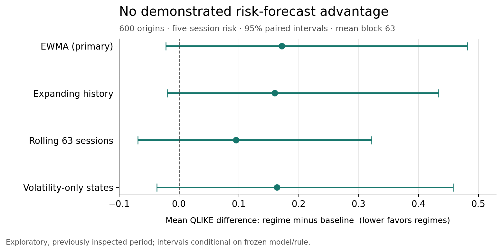

<p align="center">
  
</p>

# Wasserstein Regimes

**Market-regime research using optimal transport on full empirical return distributions.**

Treat each trailing return window as an empirical probability distribution. Compare entire distributions with Wasserstein geometry, then assign windows to learned states. The project includes exact one-dimensional W1/W2 clustering, joint sliced-W2 medoids, chronological market studies, robustness controls, frozen inference and regime-conditioned risk forecasting.

**Research question:** What market-state information is lost when return distributions are compressed into volatility or a few moments?

**Current status:** The engineering and research deliveries through **phase 6** are implemented. The latest exploratory risk study found **no demonstrated forecasting advantage over simple baselines**. Cross-provider and point-in-time validation remain open; phase 7 starts with controlled tests of within-window temporal order. See the [current roadmap](docs/research-roadmap.md).

## What is implemented

| Area | Capabilities |
| --- | --- |
| Univariate distributions | Exact W1/W2 on equally weighted samples; median/mean quantile barycenters; location/scale/shape decomposition |
| Joint distributions | Synchronized multi-asset windows, fixed-projection sliced W2, training-frozen scales and sampled observed-window medoids with bounded candidate budgets |
| Data and chronology | Adjusted-close CSV ingestion, exchange calendars, observation availability, snapshot hashes, no filling of missing returns and raw-price interval purging |
| Evaluation | Feature, volatility, covariance/correlation and causal HMM baselines; synthetic controls; seed, refit, return-block, stationary-null and contamination checks |
| Execution | Immutable model bundles, contract-checked snapshot scoring, isolated workers, bounded BLAS threads, complete artifact inventories and verified job resumption |
| Risk forecasting | Causal five-session basket-risk forecasts, four simple baselines, QLIKE/MSE losses and paired stationary-bootstrap uncertainty |

The univariate method clusters all order statistics. For equal-size sorted samples, `W1 = mean(abs(x-y))` and `W2² = mean((x-y)²)`. W2 uses mean quantile barycenters; W1 uses median quantile barycenters. The multivariate extension instead uses observed windows as medoids under finite-projection sliced W2. It is an approximation to sliced geometry, not a full multivariate W2 solver or a multivariate barycenter k-means implementation.

Both representations discard temporal order **within** a window. Chronological evaluation and causal assignment do not restore that missing information. A cluster describes observed distributions; it does not by itself establish a persistent state, forecast value or a trading rule.

## What the studies found

| Study | Measured finding | Details |
| --- | --- | --- |
| SPY univariate | **97.87%** of raw-W2 centroid separation is scale; holdout agreement with volatility-only clustering is **ARI 0.990** | [Results](docs/research-results.md) |
| Independent QQQ/TLT/GLD/HYG replication | Scale contributes **95.27–97.53%** of raw centroid separation; shape stability is mixed | [Results](docs/cross-asset-results.md) |
| Joint synthetic controls | Sliced transport detects dependence changes missed by marginal representations; covariance remains an important control | [Results](docs/joint-results.md) |
| Joint market panel | Six models evaluated on the same **605** synchronized five-asset windows | [Results](docs/joint-market-results.md) |
| Joint robustness | Return-level resampling averages **ARI 0.518**; 1% extreme training contamination collapses validation assignments to one state | [Results](docs/joint-validation-results.md) |
| Frozen scoring and scale | Reproduces **690/690** saved validation labels; all **11** experiment jobs resume from verified artifacts | [Measurements](docs/execution-results.md) |
| Five-session risk forecasting | **600** scored forecasts; joint regimes have higher mean primary QLIKE loss than all four baselines | [Results](docs/risk-results.md) |

The risk study uses an equal-weight SPY/QQQ/TLT/GLD/HYG basket and targets the next five sessions' **average daily squared simple return**. It forecasts a conditional second moment; interpreting this as variance additionally assumes zero conditional mean. Comparators are expanding history, EWMA, rolling history and volatility-only states.

The primary regime-minus-EWMA QLIKE difference is **+0.1715**, with a paired 95% interval of **[−0.0217, +0.4816]**. Lower loss is better. The interval includes zero, so the study establishes neither superiority nor equivalence. All prespecified baseline and block-length comparisons are published.



The joint market and risk assessments reuse a previously inspected 2024–August 2026 period and are explicitly **exploratory**. Adjusted provider history is revised data, not a verified point-in-time archive. These results do not establish trading profitability. Read the [frozen risk protocol](docs/risk-protocol.md); aggregate evidence and checksums are in [results](results/).

## Quick start: no market data required

Requires Python 3.11+. The numerical estimators require only NumPy.

```bash
git clone https://github.com/kenchengkc/wasserstein-regimes.git
cd wasserstein-regimes
python3 -m venv .venv
source .venv/bin/activate
python -m pip install -e .
python examples/synthetic.py
```

The example fits a synthetic variance-switching process retrospectively. It is a mathematical smoke test, not a chronological forecast evaluation or reproduction of the motivating paper.

A self-contained univariate example:

```python
import numpy as np
from wasserstein_regimes import WassersteinKMeans

rng = np.random.default_rng(42)
train_windows = np.vstack([
    rng.normal(0, 0.005, size=(100, 63)),
    rng.normal(0, 0.020, size=(100, 63)),
])
test_windows = rng.normal(0, 0.010, size=(5, 63))

model = WassersteinKMeans(metric="w2", n_clusters=2, n_init=20, random_state=42)
model.fit(train_windows)
labels = model.predict(test_windows)
distances = model.transform(test_windows)  # True W2 distances, not squared W2.
```

For joint windows, use arrays shaped `(windows, observations, assets)`:

```python
import numpy as np
from wasserstein_regimes.sliced import SlicedWassersteinKMedoids

joint_windows = np.random.default_rng(42).normal(size=(120, 63, 3))
joint_model = SlicedWassersteinKMedoids(
    n_clusters=3, n_projections=32, candidate_size=32,
    n_init=3, random_state=42,
)
joint_model.fit(joint_windows)
joint_labels = joint_model.predict(joint_windows[:5])
```

These toy arrays illustrate the APIs. Use training-only scales and the strict alignment contract for empirical joint studies; see the [joint design](docs/joint-design.md).

## Reproduce the research

From the repository root with the virtual environment active:

```bash
python -m pip install -r requirements-research.txt
python -m pip install -e '.[research,dev,data]'
export PYTHONPATH=src
export VECLIB_MAXIMUM_THREADS=1
python -m pytest
```

The requirements file records tested direct dependencies; it is not a complete platform lockfile. Research commands need the `research` extra. Acquisition uses the optional `data` extra. The resumable worker executor supports local Linux/macOS filesystems.

**Market CSVs, fitted medoids and per-origin audit rows are not bundled.** Published studies use immutable Yahoo Finance adjusted-close snapshots acquired through yfinance. Follow [data sourcing](docs/data.md) and the relevant workflow to obtain local inputs, record hashes and create development artifacts. A fresh download may differ from the frozen snapshots; treat it as a new study rather than an exact reproduction. Bundles enforce the original numerical-source and dependency contract.

| Workflow | Start here |
| --- | --- |
| Univariate development, holdout and saved reports | [Reproduction guide](docs/research-workflow.md) |
| Independent-asset replication | [Cross-asset results and reproduction](docs/cross-asset-results.md) |
| Joint panel development and assessment | [Joint market protocol](docs/joint-market-protocol.md) |
| Joint robustness controls | [Validation protocol](docs/joint-validation-protocol.md) |
| Export frozen models, score snapshots and resume jobs | [Execution workflow](docs/execution-workflow.md) |
| Reproduce phase 6 | [Risk workflow](docs/risk-workflow.md) |

Once the matching local snapshots and frozen bundle are prepared, run the execution batch or risk study:

```bash
regimes run-jobs --config configs/execution.yaml --workers 2 --blas-threads 1
regimes run-jobs --config configs/risk_jobs.yaml --workers 1 --blas-threads 1
```

These configs name the original local artifact paths; check the workflows before running them. Repeating an unchanged job reuses its verified completed attempt. Changed inputs, computational sources, dependencies or BLAS settings receive a new job identity. Detailed audit files stay under ignored `artifacts/`; public [risk evidence](results/risk_forecasting/) contains aggregates and provenance only.

## Repository guide

| Path | Contents |
| --- | --- |
| [src/wasserstein_regimes](src/wasserstein_regimes/) | Transport, clustering, aligned data, evaluation, risk forecasts and execution |
| [tests](tests/) | Numerical, causal-timing, model-contract and artifact-integrity checks |
| [configs](configs/) | Frozen study and job specifications |
| [results](results/) | Published aggregate evidence and checksums |
| [examples](examples/) / [benchmarks](benchmarks/) | Offline examples and numerical benchmarks |
| [scripts](scripts/) | Snapshot acquisition |
| [docs](docs/) | Designs, protocols, results, reproduction and paper review |

The [research roadmap](docs/research-roadmap.md) tracks current completion and open gates. The [original design](docs/design.md) and [initial implementation plan](docs/implementation-plan.md) retain the longer-term research context. Phase 7 will first test distributions with identical samples but different temporal order, then compare path-aware representations if the controls justify them. Full multivariate OT, entropic methods, GPU work, live data services and trading integration remain future work.

## Documentation

```bash
python -m pip install -r requirements-docs.txt
python -m mkdocs build --strict
python -m mkdocs serve
```

Vercel serves the static MkDocs output from `site/` with `framework: null`. There is no Python HTTP entrypoint to configure. Documentation builds neither download market data nor run research.

## Paper and license

Motivated by Horvath, Issa and Muguruza, [Clustering Market Regimes using the Wasserstein Distance](https://arxiv.org/abs/2110.11848v1). This is an independent research implementation; the daily studies do not reproduce the paper's hourly experiment. See the [paper review](docs/paper-review.md) and [academic comparisons](docs/research-roadmap.md).

Original code and documentation are **GNU GPL v3 only** (`GPL-3.0-only`); see [LICENSE](LICENSE). Third-party data and papers retain their own terms.
