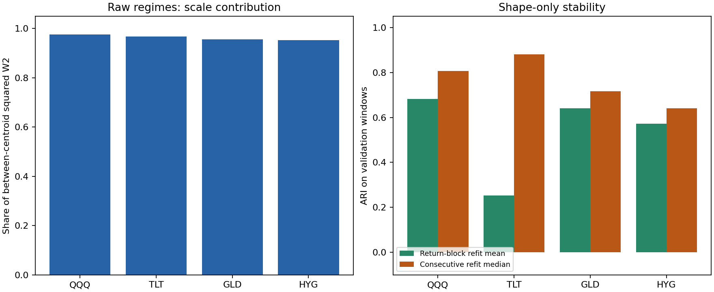

# Cross-asset replication results

The frozen SPY methodology was replicated independently on QQQ, TLT, GLD and HYG. **Scale accounts for 95.27–97.53% of raw-W2 centroid separation across all four assets. Shape-only stability is mixed, and incremental predictive value remains untested.**

## Measured comparison

| Asset | K | Scale share | Raw/volatility ARI | Shape block ARI | Shape refit median ARI | Raw occupied states |
| --- | ---: | ---: | ---: | ---: | ---: | ---: |
| SPY (prior study) | 3 | 97.87% | 0.990 | 0.664 | — | 2 |
| QQQ | 3 | 97.53% | 0.939 | 0.683 | 0.807 | 2 |
| TLT | 2 | 96.76% | 1.000 | 0.254 | 0.880 | 1 |
| GLD | 4 | 95.63% | 0.727 | 0.640 | 0.717 | 4 |
| HYG | 4 | 95.27% | 0.000 | 0.573 | 0.641 | 1 |

Scale share describes training-centroid geometry. Raw/volatility ARI describes assignments on 605 strict holdout windows per asset, from 2024 through August 2026. Shape block ARI is the mean of 20 return-block refits scored on validation windows; shape refit median compares five consecutive saved-model pairs on the later model's validation windows. These are distinct diagnostics, not interchangeable estimates or confidence intervals. SPY is the unchanged earlier study; its consecutive-refit median was not computed here.



## What the evidence supports

Raw transport clusters largely reflect scale, but high scale contribution does not guarantee identical volatility partitions. GLD has raw/volatility ARI 0.727. HYG has ARI 0.000 while its raw model assigns every holdout window to one state. TLT also occupies only one raw state: its ARI of 1.000 reflects two constant partitions, not successful identification of multiple regimes. QQQ occupies two of three raw states; GLD occupies all four.

Shape-only clustering produces multiple occupied states in every asset, but its stability depends on both asset and perturbation. Block-refit mean ARIs range from 0.254 for TLT to 0.683 for QQQ. TLT's consecutive-refit median is much higher (0.880), illustrating why one stability measure is insufficient. The 20-replicate block ARI ranges are QQQ 0.082–0.889, TLT −0.036–1.000, GLD 0.383–0.853 and HYG 0.283–0.745; these ranges are descriptive, not confidence intervals.

Consecutive shape-refit medians range from 0.641 to 0.880. All five comparisons per asset are nondegenerate under the prespecified both-single-state flag. Individual refits are less stable than their medians can suggest: GLD reaches ARI 0.196 and HYG 0.244. GLD's least occupied holdout shape state contains only four of 605 windows. Full per-period occupancy, refit ARIs, changing K and overlap diagnostics remain in the aggregate evidence.

This replication supports retaining shape-only clustering as a research diagnostic. It does not justify treating the states as universally stable or useful for trading or risk prediction. A future predictive study would need a separately frozen target, chronological evaluation, baseline comparison and treatment of overlapping outcomes before inspecting its test results.

## Frozen method and provenance

The protocol was committed before evaluating these assets in commit `cac499d`; snapshot configurations in `e52a14b`. Each asset uses 63-return empirical distributions, fit stride 5, daily scoring, K=2–5 selected by validation raw-W2 silhouette, 20 empirical restarts and the same nine models as SPY. Five development test years (2019–2023) precede the fixed holdout. No pooling or asset-specific tuning was introduced.

Development runs used `9800309`; holdout execution used `e6c2a15`, which changed the command's default to development and preserved acquisition metadata, without changing estimators. Consecutive-refit comparisons reload saved models without fitting. Equal-K centroids are matched; different-K comparisons retain ARI without claiming a centroid bijection.

Prices are revised Yahoo Finance adjusted closes retrieved through yfinance 1.7.0 on September 21, 2026. They are not point-in-time histories. Every asset has complete expected exchange-session coverage through August 31, 2026. Training starts at each ETF's own inception, so history length and asset class are confounded. ETF observations are correlated; four assets are not four independent statistical replications. Daily windows overlap. No inferential significance or forecasting claim follows from this table.

| Asset | First price | Observations | Development run | Holdout run |
| --- | --- | ---: | --- | --- |
| QQQ | 1999-03-10 | 6912 | `a362eb771be46ffab5b4` | `b6078427d1de65e10274` |
| TLT | 2002-07-30 | 6061 | `cbf040d3c347b0580e84` | `4a1ea5c823e12a564f10` |
| GLD | 2004-11-18 | 5479 | `7acc75f00006c383621c` | `28562cebe13075097ea3` |
| HYG | 2007-04-11 | 4879 | `30f950c58235634d3186` | `cf8f61605d527b4ef196` |

Acquisition timestamps, full snapshot hashes, model manifests, aggregate fold metrics and refit comparisons are published in [the aggregate evidence](https://github.com/kenchengkc/wasserstein-regimes/tree/feat/cross-asset-robustness/results/cross_asset). Raw prices and per-window market observations remain local. All eight sealed run artifacts passed checksum verification; the public aggregate files have their own checksum inventory.

## Reproduction

Install the research and data extras, acquire each asset with `scripts/download_spy.py --symbol TICKER` (see its `--help`), and use the frozen configurations under `configs/cross_asset/`. Live downloads can revise historical prices and will not necessarily match the recorded hashes. Do not replace a frozen hash silently.

```sh
regimes cross-asset --config configs/cross_asset/study.yaml --stage development
regimes cross-asset --config configs/cross_asset/study.yaml --stage holdout
```

The second command requires verified development artifacts matching every frozen configuration. Omitting the stage defaults to development. Explicit `--stage all` runs development for all assets before opening any holdout. The command writes an index, per-asset reports, a comparison CSV, a figure and a self-contained HTML report. Per-run manifests record the actual execution environment and source identity.
