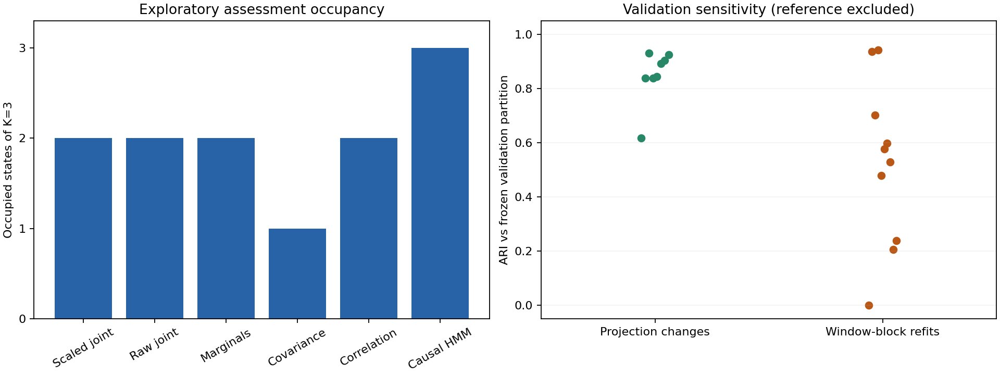

# Exploratory synchronized market study

The joint model yields two occupied states out of three on the assessment period, but remains sensitive to resampling. **This study adds descriptive joint-distribution evidence; it does not establish stable new market regimes or predictive value.**

SPY, QQQ, TLT, GLD and HYG use a common history beginning with the April 11, 2007 price observation. The original immutable snapshots are unchanged. Training ends in 2020, validation in 2023, and assessment in August 2026. This assessment period was examined in earlier marginal studies and is explicitly exploratory.

## Measured comparison

Every model scores the same 605 strict windows from **April 3, 2024 through August 31, 2026**. The first quarter is excluded by the 63-return window and raw-price-interval purge. K=3 was selected using the scaled joint model's validation silhouette and shared by all six models.

| Model | Occupied states | State counts (unmatched labels) | ARI versus scaled joint |
| --- | ---: | --- | ---: |
| Scaled joint | 2 / 3 | [0, 110, 495] | 1.000 (self) |
| Raw joint | 2 / 3 | [0, 115, 490] | 0.915 |
| Marginals | 2 / 3 | [554, 0, 51] | 0.511 |
| Covariance | 1 / 3 | [605, 0, 0] | 0.000 |
| Correlation | 2 / 3 | [7, 0, 598] | -0.017 |
| Causal HMM | 3 / 3 | [346, 17, 242] | 0.026 |

State numbers are arbitrary within each model and are not matched across the table. ARI is label-invariant. Agreement is not accuracy: there are no known market-state labels. Correlation clustering places 598 of 605 windows in one state; covariance clustering uses one state throughout. These are adverse baseline/coverage findings, not evidence that the joint model predicts better.



## Stability and novelty

- Raw and training-scaled joint partitions agree strongly on assessment (ARI **0.915**), and both leave one fitted state unused.
- Eight non-reference projection settings have validation ARIs **0.616–0.931**. The ninth setting repeats the frozen 64-projection, seed-42 reference and has ARI 1.000 by construction. Do not treat that self-comparison as independent stability evidence.
- Ten conditional window-block refits have mean validation ARI **0.521**, range **0.000–0.943**. One refit assigns all 690 validation windows to a single state. Original scales and projections stay fixed: this is neither full-pipeline uncertainty nor a confidence interval.
- **12.4%** of scaled-joint assessment windows exceed the frozen validation 99th-percentile nearest-prototype distance; raw joint reaches **20.5%**. Validation exceedances are about 1% by calibration. These are descriptive novelty flags with overlapping inputs, not tail probabilities or independent hypothesis tests.

The evidence favors more stress testing before treating these partitions as stable risk states. The synthetic parity success establishes a representational capability; this empirical comparison does not establish that markets exhibit the same useful structure.

## Model selection and baseline validity

The selection sample contains at most 160 seeded validation windows. K=2 gives one occupied state on that sample and is ineligible for silhouette; K=3 scores 0.393, K=4 scores 0.236 and K=5 scores 0.253. The selection criterion is descriptive and overlaps in time. No alternative settings were chosen after assessment.

Training contains 3,395 score windows and 679 fit windows at stride 5. Validation contains 690 strict windows from April 6, 2021 through December 29, 2023. Each asset scale comes from its unique training returns. Covariance/correlation feature transformations are fitted only on training windows; the marginal representation retains every per-asset quantile without coordinate standardization.

The Gaussian HMM uses full-covariance emissions on daily return vectors and causal forward filtering. All three starts converged in 34–49 iterations; the best training likelihood selects the model. Filtering carries information through intervening observations before selecting the shared evaluation endpoints. No smoothed or Viterbi states enter this comparison.

## Reproduction and provenance

The [protocol](joint-market-protocol.md) and [implementation plan](joint-market-plan.md) were recorded before running the new market models. The final reviewed execution code is commit `bcbb2ab`; run identity is `joint-market-9277c7c4c48af92b2d83`. All development and assessment research files passed checksum verification. Assessment loads sealed development models and checks their source/dependency versions, configuration, acquisition identity and development digest; it never fits.

```sh
regimes joint-study --config configs/joint_market.yaml --stage development
regimes joint-study --config configs/joint_market.yaml --stage assessment   --development artifacts/joint-market-<run-id>/development
```

Use the parent directory of the report.html path printed by the first command. Omitted stage defaults to development. Later code, dependency or snapshot changes produce different identities or fail compatibility checks. Raw prices, learned observed-window medoids and per-window assignments stay local; [public aggregate evidence](https://github.com/kenchengkc/wasserstein-regimes/tree/feat/scalable-joint-regimes/results/joint_market) includes configurations, source metadata, all model diagnostics, all sensitivity rows and checksum inventories.

## Remaining limitations and next work

These are revised adjusted-close histories, not point-in-time data. SPY was retrieved earlier than the four other snapshots. The common history removes differing inception lengths from this panel comparison, but does not remove provider revisions, chosen-universe effects or dependence among overlapping windows. Cross-provider sensitivity is still untested.

Next, freeze a stationary dependence-null and outlier/rare-transition stress suite, extend chronological refit comparisons, and compare candidate budgets without selecting on assessment. A predictive risk study needs separate targets, losses, baselines and a new untouched period; the existing assessment must remain exploratory. Neither these results nor the synthetic controls justify a trading claim.
