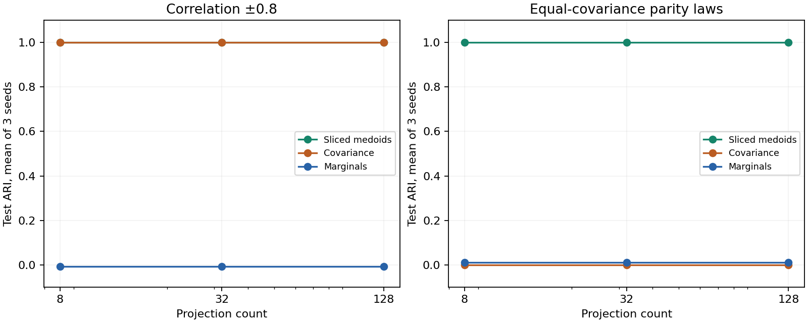

# Joint distribution engine: measured synthetic results

The new engine detects changes in joint dependence while retaining every projected empirical atom. It uses fixed-projection sliced W2 and observed medoids selected from bounded candidate sets. This is an approximate multivariate research extension; the established univariate W1/W2 engines remain available.

## Evidence

In the deterministic two-asset control, both marginal distributions are exactly identical but the joint laws differ. Marginal embedding distance is **0** and sliced distance along two diagonal directions is **√2**. A second deterministic control has identical marginal distributions and covariance matrices but different third-order dependence.

The random-window study fits 120 independent windows and predicts 120 separately generated windows for each of three seeds (17, 42, 83). The correlation case has 63 atoms per window; the parity case has 64. Each model uses K=2, candidate budget 64 and three candidate restarts. Projection counts 8, 32 and 128 are all reported. Baselines use the same samples with 20 k-means starts.

| Control | Sliced medoid test ARI | Marginal test ARI range | Covariance test ARI range |
| --- | ---: | ---: | ---: |
| Normal marginals, correlation −0.8 versus +0.8 | 1.000 in all 9 runs | −0.008 to −0.004 | 1.000 |
| Three-dimensional parity laws, equal covariance | 1.000 in all 9 runs | −0.007 to 0.046 | −0.007 to 0.015 |



The parity laws are uniform on (1,1,1), (1,−1,−1), (−1,1,−1), (−1,−1,1) and the negation of that support. Both have zero mean, identity population covariance and equal Rademacher marginals; the product of their three coordinates has opposite sign. This deliberately constructed control tests information beyond covariance. It is an easy, separated geometry control, not a realistic market model.

Correlation detection alone offers no advantage over covariance clustering. The parity result demonstrates that the joint representation can retain additional information. Neither establishes market regime stability, forecasting skill, statistical significance or a change-point detection delay. Three seeds are not a power study. Data and projection seeds vary together, and candidate sampling can miss rare states. A crossed seed, projection-count, sample-length and separation study remains necessary.

## Measured scale and limits

| Windows | Atoms | Assets | Fit seconds | Score 1,000 seconds | Peak traced fit allocation | Input memory |
| ---: | ---: | ---: | ---: | ---: | ---: | ---: |
| 1,000 | 63 | 5 | 0.068 | 0.022 | 5.07 MiB | 2.40 MiB |
| 10,000 | 63 | 5 | 0.475 | 0.023 | 5.14 MiB | 24.03 MiB |

These are single timed observations after warmup on the recorded local machine, with 32 projections, 64 candidates, three medoids, two restarts and chunk size 32. Thread limits were requested; the manifest records the backend. A separate fit measures traced allocations; timing runs do not trace memory. Traced allocation excludes the already allocated input and is **not process RSS**. No speedup against another implementation is claimed.

At fixed candidate budget M, the fit uses a candidate M×M matrix, candidate projected features and chunked scoring. Increasing the budget increases memory quadratically in M. Input tensors remain resident, and transform's returned N×K distance matrix consumes memory proportional to N. Prediction streams labels without retaining a full projected-training tensor. Finite-precision distances can underflow for extremely small numerical magnitudes; rescale such inputs.

## Usage

Install the existing research extra for the data builder and experiment; the sliced engine itself requires only NumPy.

```python
import numpy as np
from wasserstein_regimes import SlicedWassersteinKMedoids
from wasserstein_regimes.joint import joint_windows

# Each mapping value is an existing ReturnSeries. Align a common history explicitly
# first: the builder refuses mismatched dates, price intervals or return bases.
train_batch = joint_windows(training_series_by_symbol, length=63, stride=5)
test_batch = joint_windows(test_series_by_symbol, length=63, stride=1)
assert train_batch.symbols == test_batch.symbols

# Historical scales from UNIQUE training return observations, not overlapping windows.
scales = np.array([
    np.nanstd(series.returns, ddof=0)
    for series in training_series_by_symbol.values()
])
model = SlicedWassersteinKMedoids(
    n_clusters=3, n_projections=64, candidate_size=128,
    n_init=3, scales=scales, random_state=42,
).fit(train_batch.samples)
labels = model.predict(test_batch.samples)
distances = model.transform(test_batch.samples)  # true distances; inertia_ is squared
model.save("joint-model.npz")
restored = SlicedWassersteinKMedoids.load("joint-model.npz")
assert np.array_equal(labels, restored.predict(test_batch.samples))
```

The dictionaries above must contain already selected historical training and later test ReturnSeries, with explicit information cutoffs. Use the existing raw-price-interval purging rules before fitting and evaluating. The model receives arrays, so callers must preserve symbol order; the builder returns it explicitly. Saved models freeze scales, projections and medoids. The engine never learns preprocessing from prediction windows. Constant training assets require an explicit exclusion or scaling policy because zero scales are rejected.

Run the complete synthetic and scaling example:

```sh
PYTHONPATH=src VECLIB_MAXIMUM_THREADS=1 python examples/joint_study.py   --output artifacts/joint-synthetic.json
```

Published measurements are in [results/joint-synthetic.json](https://github.com/kenchengkc/wasserstein-regimes/blob/feat/scalable-joint-regimes/results/joint-synthetic.json), including every run, configuration, source commit, example hash and machine description. The [design](joint-design.md) describes interfaces and memory costs; the [roadmap](research-roadmap.md) gives academic sources and the next empirical gates.

## Next empirical study

Use a common-history aligned panel, explicit raw versus training-scaled ablations, covariance/correlation and marginal baselines, projection and block stability, and stationary dependence nulls. Freeze the protocol before examining a new evaluation period. The existing 2024–August 2026 holdout has already been inspected and cannot become untouched evidence for model selection. Risk forecasting remains a separate experiment.
