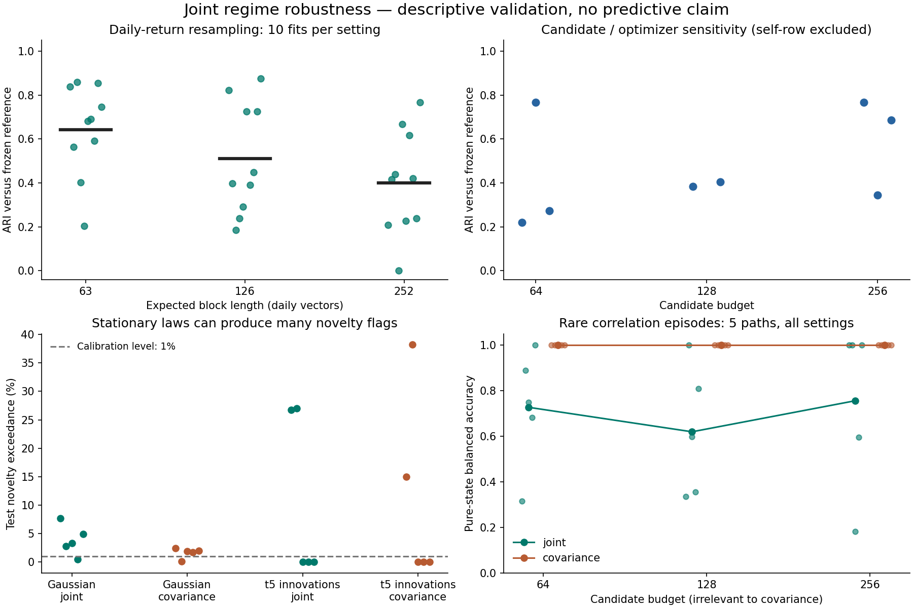

# Joint robustness results

**The partitions remain fragile. Stationary processes can produce persistent clusters and novelty flags, and modest-frequency extreme training contamination can collapse the market partition.** This phase does not support treating the current model as a stable risk-state classifier.

The frozen [protocol](joint-validation-protocol.md) produced **44 market sensitivity comparisons and 80 synthetic method results**. All market comparisons use the same 690 purged validation windows from April 6, 2021 through December 29, 2023. No assessment observations were evaluated, and the preceding results were not retuned.



Dots show every run; horizontal marks or connected points show arithmetic means, not confidence intervals. Synthetic candidate settings reuse the same five paths. Covariance results repeat across candidate budgets because the budget does not enter that baseline.

## Rebuilding windows from resampled daily returns

Each fit resamples synchronized training vectors, recomputes asset scales, and rebuilds trailing windows. K=3 and projection directions stay fixed. This tests more of the pipeline than the preceding conditional window bootstrap, but does not include uncertainty in model selection.

| Expected block length | Repeats | Mean validation ARI | Range | Single-state fits |
| --- | ---: | ---: | --- | ---: |
| 63 daily vectors | 10 | 0.643 | 0.203–0.860 | 0 |
| 126 daily vectors | 10 | 0.510 | 0.184–0.876 | 0 |
| 252 daily vectors | 10 | 0.400 | 0.000–0.766 | 1 |

Mean ARI across all 30 refits is **0.518**. ARI measures agreement with the frozen reference, not accuracy. The resemblance to the earlier window-bootstrap mean of 0.521 does not make these equivalent experiments.

Synthetic block joins affect 341–458 of 679 fit windows at block length 63, 219–329 at length 126, and 113–231 at length 252. These seams are part of the perturbation, not observed market transitions. The small set of resamples supplies sensitivity measurements, not confidence intervals or a stationarity test.

## Training history, optimization and contamination

- Expanding histories ending in **2015** and **2017** have validation ARIs **0.730** and **0.206**. Repeating the full 2020 training prefix reproduces the saved reference exactly. Earlier refits use K selected on the later development history, so these are retrospective sensitivity checks.
- Eight non-reference candidate-budget/optimizer settings yield ARIs **0.219–0.766**. The 128-candidate, seed-42 row is the reference and is excluded from this range. Increasing the budget does not consistently increase agreement; agreement also does not measure objective optimality.
- Adding signed ten-standard-deviation shocks to **4 of 3,457 training vectors** (nominal 0.1%) leaves validation labels unchanged in this seeded experiment. Contaminating **35 vectors** (nominal 1%) collapses all 690 clean validation windows into one state, with ARI **0.000**. Scales are refitted after contamination. This is a specific stress scenario, not an estimate of real-world contamination frequency.

All winning joint fits and all candidate restarts converged under the optimizer's stopping rule. Convergence is therefore insufficient evidence of partition stability or global optimality.

## A stationary law still produces apparent regimes

The nulls keep dependence parameters constant: equicorrelation 0.45 and AR(1) coefficient 0.25. Gaussian and variance-normalized multivariate Student-t(5) innovations each use five seeds. Every fit is forced to use K=3; the test set has 688 overlapping windows per path.

| Innovations | Model | Mean dwell (scored windows) | Mean novelty exceedance | Exceedance range |
| --- | --- | ---: | ---: | --- |
| Gaussian | Joint | 20.2 | 3.84% | 0.44–7.70% |
| Gaussian | Covariance | 13.7 | 1.66% | 0.15–2.47% |
| Student-t(5) | Joint | 38.1 | 10.76% | 0.00–27.03% |
| Student-t(5) | Covariance | 44.2 | 10.64% | 0.00–38.23% |

Dwell entries average the five within-path mean run lengths. Novelty thresholds are each model's calibration 99th-percentile nearest-center distance. The models use different distance geometries. Calibration and test segments share no daily vectors, but windows overlap within each segment. Gaussian joint partitions occupy three states in every seed; Student-t joint partitions occupy two or three. Their mean sampled silhouettes are 0.135 and 0.080 respectively, despite there being no true regime change.

Long dwell and positive silhouette can arise from overlapping samples of a single stationary process. A validation percentile is not a guaranteed future false-flag rate, especially with heavy tails and small dependent samples. These ten paths are illustrative null controls, not a calibrated market hypothesis test or estimates of a universal false-regime probability. Student-t innovations are burned in for 512 vectors; the AR returns themselves are not claimed to follow an exact Student-t distribution.

## Rare and gradual changes

The changing controls keep each marginal population distribution N(0,1) and change correlation from 0.2 to 0.8. Covariance is therefore an appropriate comparator; no advantage beyond covariance is established by this setup. Label mapping uses pure training windows only.

For 126-vector rare episodes, each test path has **64 pure high-state windows** and 500 pure low-state windows; the remaining 124 mixed windows are excluded from recovery metrics.

| Joint candidate budget | Mean pure-state ARI | Mean balanced accuracy | Mean high-state recall | Censored episode detections |
| --- | ---: | ---: | ---: | ---: |
| 64 | 0.290 | 0.727 | 0.753 | 0 / 5 |
| 128 | 0.201 | 0.619 | 0.503 | 0 / 5 |
| 256 | 0.654 | 0.756 | 0.656 | 1 / 5 |

Covariance averages **0.994 ARI**, **0.999 balanced accuracy**, and **1.000 high-state recall** over the five paths, with no censored episodes. Its repeated rows across budgets are not additional independent runs. Joint performance is substantially less reliable on this control; a larger candidate pool does not guarantee rare-state recovery.

Episode delay requires five consecutive mapped high predictions before the rare episode ends. Joint runs include zero-delay cases and one censored miss. Zero delay can occur when an erroneous high prediction already precedes the event; it is not proof of immediate detection. All raw delays and censoring flags are retained in the evidence.

For gradual changes, both models separate the settled endpoints well: joint achieves **1.000 pure-state ARI** for every seed/budget; covariance averages **0.921** across five paths. **312 of 688 test windows touch the ramp and are excluded**; this result says nothing about accurate classification inside the transition or its detection time.

## Reproduction and evidence

Run identity: `joint-validation-697e0a6b40bbbfd1aed2`. Reviewed execution source: `fcd4d08029c4c216cba44e61c5f759ceb60fa0dc`. Parent: `joint-market-9277c7c4c48af92b2d83/development`. Parent numerical source hashes, dependency versions, snapshot/acquisition identities and checksum inventory are verified before fitting or reusing a cache. New source/configuration and the parent inventory digest determine the child identity.

```sh
regimes joint-validate --config configs/joint_validation.yaml \
  --development artifacts/joint-market-9277c7c4c48af92b2d83/development
```

The command prints the report path. A matching complete run is verified and reused. The frozen local snapshots and sealed parent are required; new provider downloads may differ. To reproduce against the historical parent, use the recorded execution revision and dependency versions. A newly generated compatible development artifact creates a distinct child identity if its checksum inventory differs.

Synthetic controls can also run without market data:

```python
import yaml
from wasserstein_regimes.joint_controls import run_controls

with open("configs/joint_validation.yaml") as handle:
    results = run_controls(yaml.safe_load(handle))
```

[Public aggregate evidence](https://github.com/kenchengkc/wasserstein-regimes/tree/feat/joint-robustness/results/joint_validation) contains every row, configuration, manifest and checksum inventory. Source snapshots, observed medoids and per-window market assignments remain local. Code and documentation remain GPL-3.0-only. See the [implementation plan](joint-validation-plan.md).

## Consequences for the next phase

The engine's mathematical capability is established by earlier controls; robust empirical regime identification is still unproven. Preserve the unsuccessful results. The next engineering phase can add resumable experiment jobs, measured process memory and frozen-model scoring, while further research should compare rare-state coverage and robust alternatives under a new frozen development protocol. Neither budget tuning nor clipping is adopted from this exposed sweep. Cross-provider validation, selection uncertainty and predictive evaluation remain outstanding.
