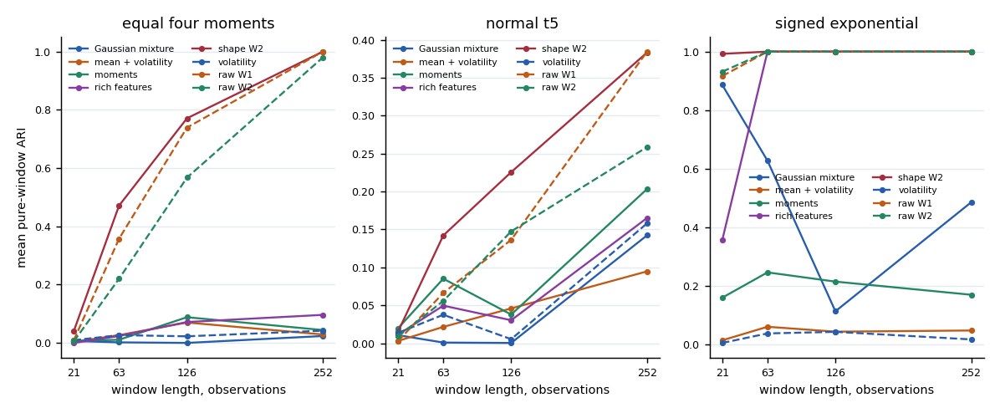
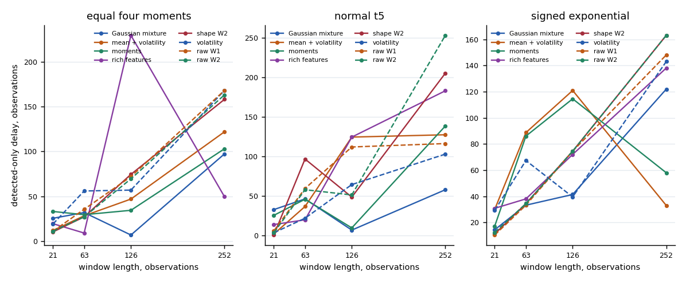

# First univariate study: results

**Conclusion:** raw W2 prototypes mostly describe volatility. Full distributions preserve information that moments can lose, but this SPY study does not establish incremental predictive or economic value from shape.

## Frozen experiment

Daily SPY adjusted closes span January 1993–August 2026. Five annual development tests cover 2019–2023. The final model trains through 2020, selects K using 2021–2023 validation, then stays fixed through January 2024–August 2026. L=63, fit stride=5, score stride=1; validation selected K=3. Strict boundary purging leaves **605 holdout windows**. Only two of the three raw-W2 states occur in this holdout.

Original specification commit: `a1d32b4`. Reviewed execution commit: `8e7f81dcbef2b47170194f8196ab0a7ac6a321ab`. Development run: `e6e1510164b7868c7c63`; holdout run: `def43ba432b899ef8452`. Decisions were fixed before holdout evaluation.

## What drives separation?

Between the three fitted centroids, **97.87%** of summed squared W2 distance is scale, **1.62%** location and **0.51%** shape. These are training-prototype geometry measurements, not holdout estimates. Holdout assignments have **ARI 0.990** against volatility-only clustering and **0.930** against richer handcrafted features.

Shape contributes more to within-assignment residual distances. That does not show it drives the raw partition: centroid separation and residual variation answer different questions.

| Model | Holdout ARI against raw W2 | Occupied / fitted states |
| --- | ---: | ---: |
| gmm | 0.365 | 3 / 3 |
| hmm | 0.071 | 3 / 3 |
| mean_vol | 0.649 | 2 / 3 |
| moments | 0.573 | 3 / 3 |
| rich | 0.930 | 2 / 3 |
| shape_w2 | 0.022 | 3 / 3 |
| volatility | 0.990 | 2 / 3 |
| w1 | 0.431 | 2 / 3 |
| w2 | 1.000 | 2 / 3 |

ARI measures agreement, not correctness. Raw/shape W2 agreement is only 0.022. Distinct shape clusters therefore exist, but difference from volatility is not evidence of predictive usefulness. In some development years both raw W2 and volatility assign all test windows to one state; their ARI=1 is degenerate agreement.

## Stability and overlapping windows

On validation data, mean ARI over 20 return-block refits is 0.795 for raw W2, 0.785 for volatility, 0.664 for shape W2 and 0.486 for moments. These are sensitivity measurements, not independent replications of market history. Seed agreement is approximately one for several models, including forced stationary partitions.

| Fit stride | Validation mean dwell | IID overlap-null mean dwell | Observed minus null |
| ---: | ---: | ---: | ---: |
| 1 | 98.6 | 90.2 | 8.4 |
| 5 | 138.0 | 78.9 | 59.1 |
| 21 | 98.6 | 81.9 | 16.7 |
| 63 | 76.7 | 85.1 | -8.5 |

The null resamples the development return marginal independently, then rebuilds overlapping windows and fits the same K. Twenty draws yield wide ranges: persistence alone is weak evidence. Fitting on stride-63 windows still produces validation assignments with ARI 0.931 against the stride-5 model, but its mean dwell is slightly below the null mean.

## Synthetic evidence and statistical power

The exact signature fixture contains disjoint 300-atom distributions whose first four empirical moments match exactly. Their W2 distance is 0.565685 in fixture units. W1 and W2 both achieve held-out ARI=1; volatility and four-moment baselines correctly collapse to one effective cluster and ARI=0. This is an information-loss counterexample, not market-performance evidence.

For noisy rolling samples, equality holds in population only. Ten independent streams per contrast show the sample-size tradeoff:

| Contrast, raw W2 pure-window ARI | L=21 | L=63 | L=126 | L=252 |
| --- | ---: | ---: | ---: | ---: |
| equal_four_moments | 0.005 | 0.220 | 0.567 | 0.980 |
| normal_t5 | 0.009 | 0.056 | 0.147 | 0.259 |
| signed_exponential | 0.931 | 1.000 | 1.000 | 1.000 |
| variance | 0.968 | 1.000 | 1.000 | 1.000 |

Delay is the first correct assignment after an internal test switch, measured on the disclosed scoring grid; it is not a persistence-confirmed change detector. Reports retain missed-detection counts. Mixed-window slices have only one endpoint-truth class, so ARI/NMI are deliberately unavailable there.

The stationary forced-K=2 control produces apparent states and nontrivial novelty alarms. For raw W2, average validation-calibrated false-flag rates are 2.4% at L=21, 1.9% at L=63, 4.8% at L=126, 22.0% at L=252. The L=252 calibration contains only ten scored windows per path; its 99th percentile is particularly unstable.

## Economic characterization

Future 21-session returns, annualized volatility, drawdown and downside deviation are computed strictly after each assignment and never enter regime construction. The saved report gives state-conditional means and descriptive block percentile intervals. No forecast comparison, causal claim, portfolio backtest or trading improvement is inferred from these differences.

## Numerical performance

The Apple M5 benchmark uses sorted float64 matrices N=2,000, K=5, L=63, three warmed repetitions, and a requested single-thread configuration. Numerical agreement is checked before timing. Timing and Python-traced memory use separate passes; sorting is excluded and traced allocation is not total process RSS.

| Kernel | Median milliseconds | Speedup against scalar | Peak traced bytes |
| --- | ---: | ---: | ---: |
| broadcast_numpy | 0.475 | 93.6× | 5172536 |
| chunked_numpy | 0.586 | 75.8× | 338760 |
| matrix_product_blas | 0.092 | 483.0× | 1168848 |
| naive_scalar_python | 44.476 | 1.0× | 80965 |

Accelerate is controlled through `VECLIB_MAXIMUM_THREADS=1`; threadpoolctl cannot independently inspect that backend here. These small-kernel timings are machine-specific, not end-to-end pipeline speedups.

## Reproduction and limitations

See [research workflow](research-workflow.md) for commands, frozen data hash, temporal assumptions and dependency versions. Machine-readable aggregate measurements are in the repository `results/` directory. Full local run directories contain models, checksums, assignments, all centroid comparisons, figures and self-contained HTML reports. Source market prices and per-window market artifacts are excluded from Git.

This is one ETF, revised adjusted-price history, one frozen holdout and limited effective observations. Novelty calibration and conditional outcome intervals are sensitive to temporal dependence and sparse occupancy. The findings justify full-distribution prototypes as a useful descriptive representation; they do **not** establish stable incremental market information beyond volatility. Cross-asset replication and separately validated risk forecasts remain future work.
